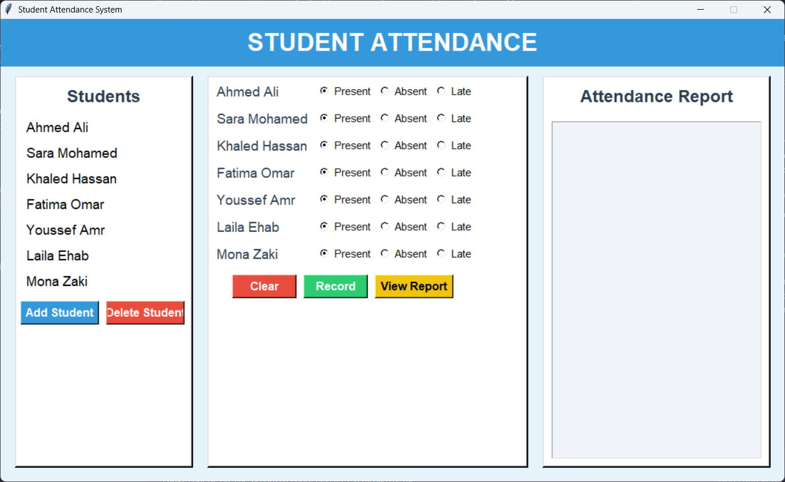
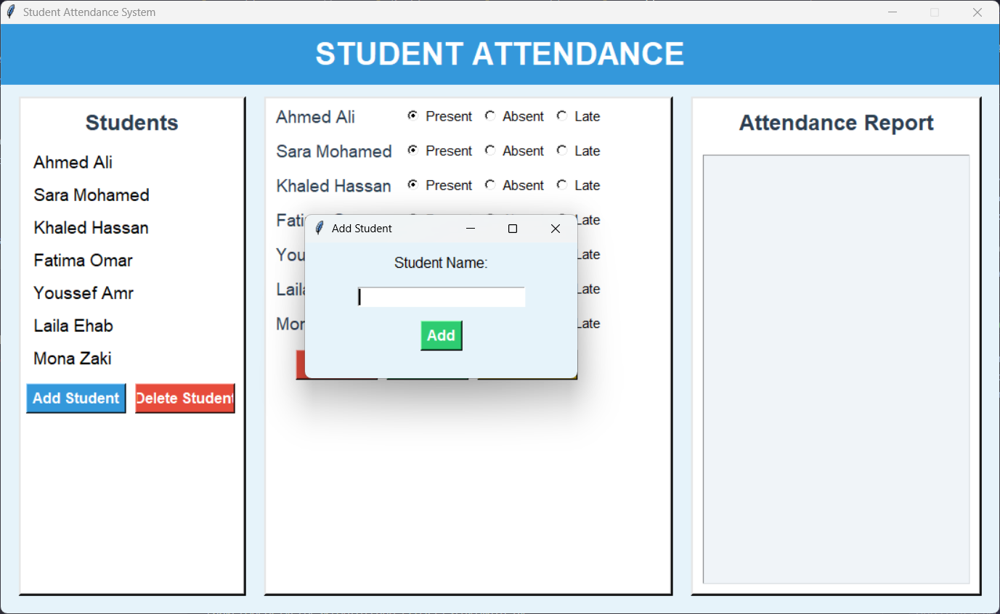
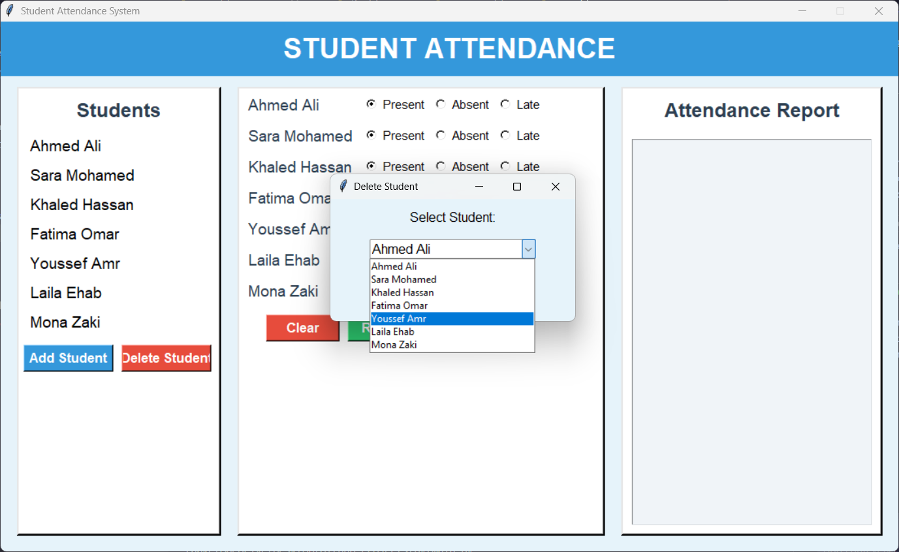
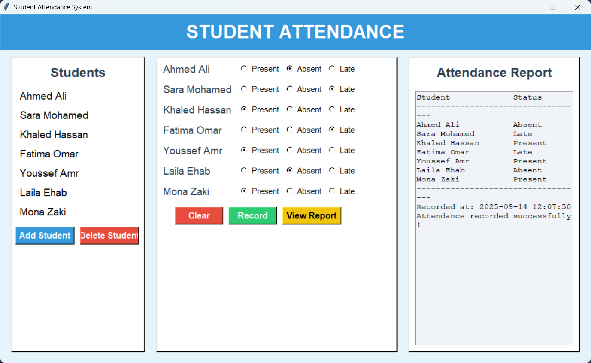
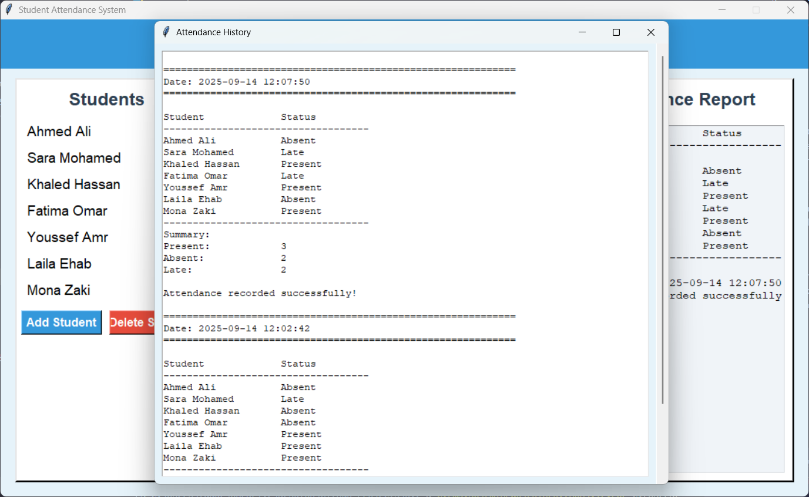

# 📝 Student Attendance System

A simple **Student Attendance Management System** built using **Python**, **Tkinter (GUI)**, and **SQLite**.  
This system allows instructors to manage student attendance, record daily attendance, and view attendance reports with a clean graphical interface.

---

## ✨ Features

- **Graphical User Interface (GUI)** using Tkinter
- **Add / Delete Students** dynamically
- **Record Attendance** with options: Present, Absent, Late
- **View Attendance Report** by date
- **Persistent Database** using SQLite
- **Summary Statistics** of attendance (Present, Absent, Late)

---

## 🖼 Screenshots

**Main Window**  


**Add Student**  


**Delete Student**  


**Attendance Report**  


**Attendance History**  


---

##⚙️ Installation

1. Make sure you have **Python 3.x** installed.
2. Clone the repository:

```bash
git clone https://github.com/yourusername/attendance-system.git
cd attendance-system
````

3. Install required packages (Tkinter is usually included with Python):

```bash
# Tkinter is included with standard Python installation
# No need to install separately
```

4. Run the application:

```bash
python main.py
```

---

## 🚀 Usage

1. **Add Student**: Click the "Add Student" button and enter the student's name.
2. **Delete Student**: Select a student from the dropdown and click "Delete Student".
3. **Record Attendance**: Select Present/Absent/Late for each student and click "Record".
4. **View Report**: Click "View Report" to see past attendance records and summary.

---

## 📂 File Structure

```
attendance-system/
│
├── main.py             # Entry point to launch the GUI
├── gui.py              # Tkinter GUI implementation
├── database.py         # SQLite database handling
├── attendance.db       # Database file (auto-created)
└── README.md           # Project documentation
```

---

## 🛠 Technologies Used

* Python 3.x
* Tkinter (GUI)
* SQLite (Database)
* OOP Design (MenuItem, Order, Bill, Customer classes)

---

## 🔮 Future Improvements

* Export attendance reports to CSV or PDF
* Add user authentication for multiple instructors
* Add search/filter for students in large classes
* Integrate with email notifications for absent students

---

## 📜 License

This project is released under the MIT License.